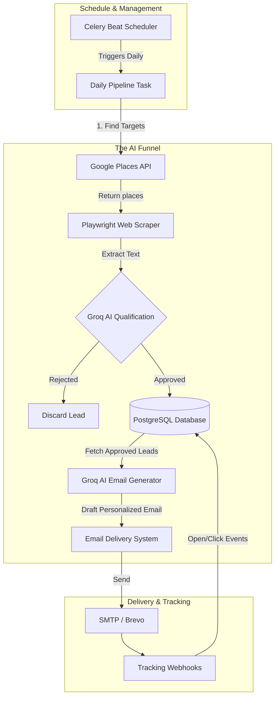

<div align="center">
  

  <h3>Automated. Intelligent. Scalable.</h3>

  <p>An end-to-end local business discovery, qualification, and personalized outreach pipeline powered by AI.</p>
  
  <p>
    
    
    
    
    
  </p>
</div>

---

## 📖 Table of Contents
- [Why We Need This in the Modern Age](#-why-we-need-this-in-the-modern-age)
- [Project Overview](#-project-overview)
- [System Architecture](#-system-architecture)
- [Key Features](#-key-features)
- [Complete System Setup](#-complete-system-setup)
  - [Prerequisites](#1-prerequisites)
  - [Environment Variables](#2-environment-variables)
  - [Local Installation](#3-local-installation-recommended-for-development)
  - [Docker Setup](#docker-installation-recommended-for-production)
- [Running the System](#-running-the-system)
- [Automated Testing](#-automated-testing)
- [License](#-license)

---

## 🌍 Why We Need This in the Modern Age

In today's highly competitive digital landscape, B2B lead generation is often a manual, tedious, and error-prone process. Sales teams spend countless hours scraping directories, validating email addresses, researching company backgrounds, and writing generic outreach emails that result in low conversion rates.

**The AI Lead Generation System** shifts the paradigm. By leveraging Large Language Models (LLMs) and distributed background processing, this system acts as a persistent, tireless 24/7 sales development representative. 

It autonomously:
1. **Discovers** niche local businesses completely organically.
2. **Scrapes & Qualifies** their websites to ensure they match your Ideal Customer Profile (ICP).
3. **Personalizes** outreach copy specifically tailored to the prospect's real-world business data.
4. **Executes** the campaign securely with built-in tracking.

---

## 🚀 Project Overview

The project is built on a robust, asynchronous tech stack designed to handle high-throughput network operations:

- **Backend API:** `FastAPI` + `Uvicorn` for high-performance RESTful operations.
- **Task Queue:** `Celery` + `Redis` for background job management and scheduled cron jobs.
- **Database:** `PostgreSQL` via `SQLAlchemy (Async)` & `asyncpg` for non-blocking I/O.
- **Scraping Engine:** `Playwright` & `BeautifulSoup4` for deep web crawling.
- **AI Brain:** `Groq API` (Llama 3) for lightning-fast business qualification and personalized email generation.

---

## 🏗 System Architecture

The workflow follows a directed acyclic pipeline running daily via Celery beat schedulers. 



---

## ✨ Key Features

| Feature | Description |
| :--- | :--- |
| **🔍 Multi-Radius Discovery** | Uses Google Places API to search for specific niches (e.g., "roofers in Austin") within a calculated geographical radius. |
| **🧠 Deep AI Qualification** | Scrapes the business's website and feeds the text to Groq LLM to answer: *Does this business need our services?* |
| **✍️ Hyper-Personalization** | Generates completely unique subject lines and email bodies referencing the prospect's specific website services. |
| **📊 Open/Click Tracking** | Injects tracking pixels and link wrappers that listen for engagement via FastAPI webhook endpoints. |
| **🛡 API Key Security** | All management endpoints are protected by `X-API-Key` headers. |

---

## ⚙️ Complete System Setup

### 1. Prerequisites
- Python 3.11+
- PostgreSQL 15+ (Local or Cloud e.g., Supabase)
- Redis Server (Local or Cloud e.g., Upstash)
- API Keys for Google Places, Groq, and an SMTP Provider (Brevo/Sendinblue).

### 2. Environment Variables
Copy the `.env.example` to `.env` and fill in the specifics:
```bash
cp .env.example .env
```
Ensure you have set `DATABASE_URL`, `REDIS_URL`, `GROQ_API_KEY`, etc.

### 3. Local Installation (Recommended for Development)

1. **Clone & Environment:**
   ```bash
   git clone https://github.com/your-username/ai-lead-generation.git
   cd "AI LEAD GENERATION"
   python -m venv venv
   source venv/bin/activate # On Windows: venv\Scripts\activate
   ```

2. **Install Dependencies:**
   ```bash
   pip install -r requirements.txt
   ```

3. **Run Database Migrations:**
   ```bash
   alembic upgrade head
   ```

### Docker Installation (Recommended for Production)

If you prefer an isolated containerized environment, ensure Docker is installed and run:
```bash
docker-compose up -d --build
```
This will spin up the FastAPI app, Celery worker, Celery beat, and (optionally) Redis and PostgreSQL containers.

---

## 🏃 Running the System

If running locally without Docker, you will need to start the processes in separate terminal windows.

**1. Start the FastAPI Server:**
```bash
uvicorn app.main:app --reload --host 0.0.0.0 --port 8000
```
> *API Documentation is available at: [http://localhost:8000/docs](http://localhost:8000/docs)*

**2. Start the Celery Worker (In a new terminal windows):**
```bash
celery -A app.core.celery_app worker --loglevel=info --pool=solo
```

**3. Start the Celery Beat Scheduler (In a new terminal window):**
```bash
celery -A app.core.celery_app beat --loglevel=info
```

---

## 🧪 Automated Testing

We enforce a strict 100% test coverage expectation across the system. 
Our End-to-End test suite automatically spins up an asynchronous SQLite memory database (`test.db`) to safely perform operations.

To run the entire suite:

```bash
pytest -v tests/
```

**Testing coverage includes:**
- ✅ Database Schema & ORM capabilities.
- ✅ Discovery Module (Mocks Google API & DOM Scrapers).
- ✅ Celery Task Pipeline validation.
- ✅ System integration & Error handling cases.

---

## 📜 License

This project is licensed under the Apache License 2.0. See the [LICENSE](LICENSE) file for more details.

<div align="center">
  <br>
  <em>Built with ❤️ to revolutionize B2B Sales</em>
</div>
