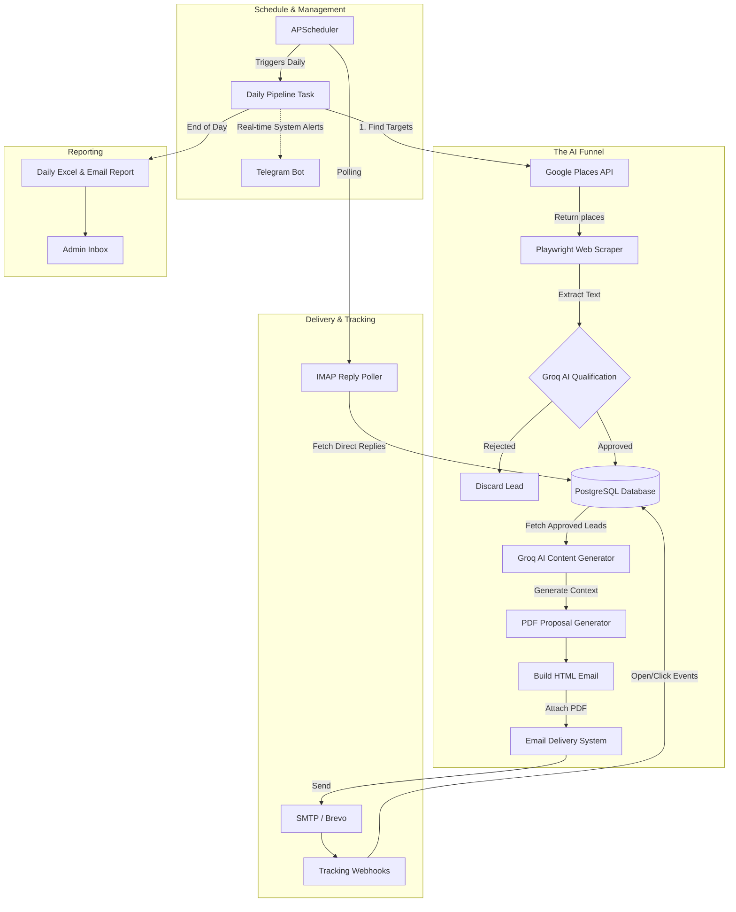

<div align="center">
  

  <a href="https://git.io/typing-svg"></a>

<p>An end-to-end local business discovery, qualification, and personalized outreach pipeline powered by AI.</p>

<p>
    
    
    
    
    
  </p>
</div>

---

## 📖 Table of Contents

- [Why We Need This in the Modern Age](#-why-we-need-this-in-the-modern-age)
- [Project Overview](#-project-overview)
- [System Architecture](#-system-architecture)
- [Key Features](#-key-features)
- [Complete System Setup](#-complete-system-setup)
  - [Prerequisites](#1-prerequisites)
  - [Environment Variables](#2-environment-variables)
  - [Local Installation](#3-local-installation-recommended-for-development)
  - [Docker Setup](#docker-installation-recommended-for-production)
- [Running the System](#-running-the-system)
- [Automated Testing](#-automated-testing)
- [License](#-license)

---

## 🌍 Why We Need This in the Modern Age

In today's highly competitive digital landscape, B2B lead generation is often a manual, tedious, and error-prone process. Sales teams spend countless hours scraping directories, validating email addresses, researching company backgrounds, and writing generic outreach emails that result in low conversion rates.

**The AI Lead Generation System** shifts the paradigm. By leveraging Large Language Models (LLMs) and distributed background processing, this system acts as a persistent, tireless 24/7 sales development representative.

It autonomously:

1. **Discovers** niche local businesses completely organically.
2. **Scrapes & Qualifies** their websites to ensure they match your Ideal Customer Profile (ICP).
3. **Personalizes** outreach copy specifically tailored to the prospect's real-world business data.
4. **Executes** the campaign securely with built-in tracking.

---

## 🚀 Project Overview

<div align="center">
  
</div>

The project is built on a robust, asynchronous tech stack designed to handle high-throughput network operations:

- **Backend API:** `FastAPI` + `Uvicorn` for high-performance RESTful operations.
- **Task Scheduling:** `APScheduler` for lightweight, in-process asynchronous task execution (Optimized for free-tiers).
- **Database:** `PostgreSQL` via `SQLAlchemy (Async)` & `asyncpg` for non-blocking I/O.
- **Scraping Engine:** `Playwright` & `BeautifulSoup4` for deep web crawling.
- **AI Brain:** `Groq API` (Llama 3) for lightning-fast business qualification and personalized email generation.
- **Monitoring & Alerting:** `Loguru` for structured logging and `Telegram Bot API` for real-time pipeline notifications.
- **Document Generation:** Auto-populates business-specific `PDF Proposals` and `Excel` daily performance reports.

---

## 🏗 System Architecture

The workflow follows a directed acyclic pipeline running daily via `APScheduler`.



---

## ✨ Key Features

| Feature                              | Description                                                                                                               |
| :----------------------------------- | :------------------------------------------------------------------------------------------------------------------------ |
| **🔍 Multi-Radius Discovery**  | Uses Google Places API to search for specific niches (e.g., "roofers in Austin") within a calculated geographical radius. |
| **🧠 Deep AI Qualification**   | Scrapes the business's website and feeds the text to Groq LLM to answer:*Does this business need our services?*         |
| **✍️ Hyper-Personalization** | Generates completely unique subject lines and email bodies referencing the prospect's specific website services.          |
| **📄 Dynamic PDF Proposals**   | Auto-generates customized business proposals for each qualified lead and attaches them to outreach emails.                |
| **🔔 Telegram Alerting**       | Real-time notifications for discovered leads, pipeline errors, and direct replies.                                        |
| **📬 Reply Polling**           | Periodically checks an IMAP inbox to automatically track direct email replies from prospects.                             |
| **📊 Open/Click Tracking**     | Injects tracking pixels and link wrappers that listen for engagement via FastAPI webhook endpoints.                       |
| **📈 Automated Reporting**     | Compiles daily outreach metrics and sends an Excel overview directly to the administrator.                                |
| **🛡 API Key Security**        | All management endpoints are protected by `X-API-Key` headers.                                                          |
| **🚀 CI/CD Ready**             | Fully configured GitHub Actions pipeline with secure environment variable injection.                                      |
| **🏗 Scalable Architecture**   | Utilizes Singleton DB connection pooling, Dependency Injection (`lru_cache`), and centralized settings management.        |
| **💸 Serverless Optimized**    | In-process APScheduler execution optimized for restrictive free-tiers (e.g., Render) by minimizing external connections and processes. |
| **🏢 Enterprise-Grade Code**   | Fully documented, strictly typed codebase featuring professional Python docstrings, structured logging, and robust entity schemas. |

---

## ⚙️ Complete System Setup

### 1. Prerequisites

- Python 3.11+
- PostgreSQL 15+ (Local or Cloud e.g., Supabase)
- API Keys for Google Places, Groq, and an SMTP Provider (Brevo/Sendinblue).

### 2. Environment Variables

Copy the `.env.example` to `.env` and fill in the specifics:

```bash
cp .env.example .env
```

Ensure you have set `DATABASE_URL`, `GROQ_API_KEY`, SMTP credentials, Telegram `TELEGRAM_BOT_TOKEN`, and `IMAP_SERVER` credentials.

### 3. Local Installation (Recommended for Development)

1. **Clone & Environment:**

   ```bash
   git clone https://github.com/your-username/ai-lead-generation.git
   cd "AI LEAD GENERATION"
   python -m venv venv
   source venv/bin/activate # On Windows: venv\Scripts\activate
   ```
2. **Install Dependencies:**

   ```bash
   pip install -r requirements.txt
   ```
3. **Run Database Migrations:**

   ```bash
   alembic upgrade head
   ```

### Docker Installation (Recommended for Production)

If you prefer an isolated containerized environment, ensure Docker is installed and run:

```bash
docker-compose up -d --build
```

This will spin up the FastAPI app and (optionally) the PostgreSQL container. All background tasks run seamlessly inside the API process.

---

## 🏃 Running the System

Start the FastAPI Server, which automatically instantiates the APScheduler for background operations:

```bash
uvicorn app.main:app --reload --host 0.0.0.0 --port 8000
```

> *API Documentation is available at: [http://localhost:8000/docs](http://localhost:8000/docs)*

---

## 🧪 Automated Testing

We enforce a strict 100% test coverage expectation across the system.
Our End-to-End test suite automatically spins up an asynchronous SQLite memory database (`test.db`) to safely perform operations.

To run the entire suite:

```bash
pytest -v tests/
```

**Testing coverage includes:**

- ✅ Database Schema & ORM capabilities (w/ SQLite compatibility logic for `postgresql.ARRAY`).
- ✅ Discovery Module (Mocks Google API & DOM Scrapers).
- ✅ Asynchronous Task Pipeline validation.
- ✅ System integration & Error handling cases.

---

## 🔮 Future Roadmap (v2.0)

We are actively planning the next major iteration of the system (V2). Our upcoming goals focus on transforming the platform from a single-channel tool into a fully autonomous, self-learning outreach machine. Key objectives include:

- **Multi-Channel Sequences:** Expanding outreach beyond email to include coordinated, multi-touchpoint sequences (e.g., WhatsApp, SMS, Telegram).
- **Enhanced Lead Discovery:** Integrating multiple new discovery sources to organically find more niche leads, paired with intelligent deduplication logic.
- **Smart AI Inbox & Auto-Replies:** Building an engine to automatically read received replies, classify their intent, and draft context-aware responses.
- **Dynamic Follow-Up Engine:** Replacing single-shot emails with intelligent, multi-step campaigns that auto-pause upon lead engagement.
- **Deep Lead Enrichment:** Gathering comprehensive background data from social channels and wider web presence before outreach to maximize personalization.
- **Self-Improving Analytics:** Implementing automated A/B testing and regular AI-driven reviews to continuously optimize messaging styles and conversion rates.

*(Note: Technical implementation models and architectural choices for these upcoming changes are managed internally).*

---

## 📜 License

This project is **PROPRIETARY AND CONFIDENTIAL**. 

It is strictly licensed only to the original author. Any other person, entity, or corporation wishing to implement, deploy, or use this system must obtain **explicit, prior written permission** from the author. 

Unauthorized copying, distribution, modification, or commercial use of this codebase is strictly prohibited. See the [LICENSE](LICENSE) file for the full End-User License Agreement (EULA) rules and regulations.

<div align="center">
  <br>
  <em>Built with ❤️ to revolutionize B2B Sales</em>
</div>
